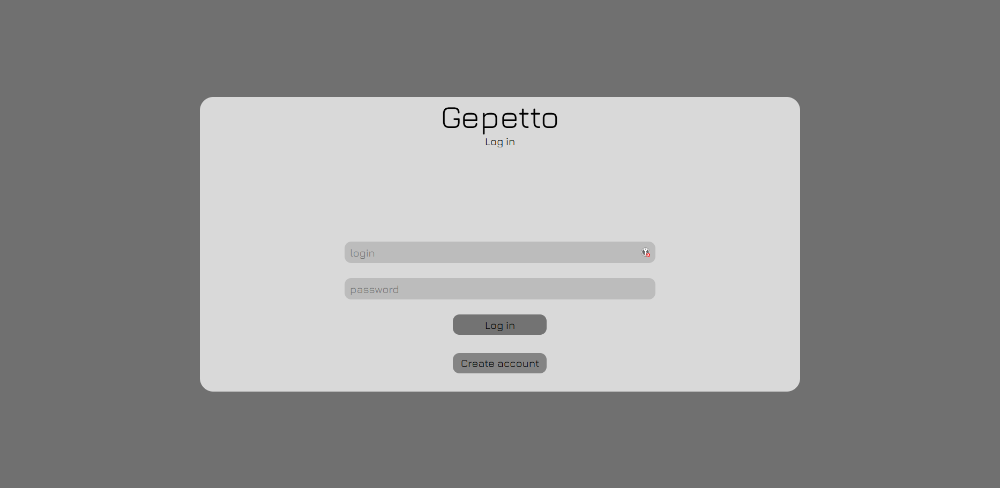
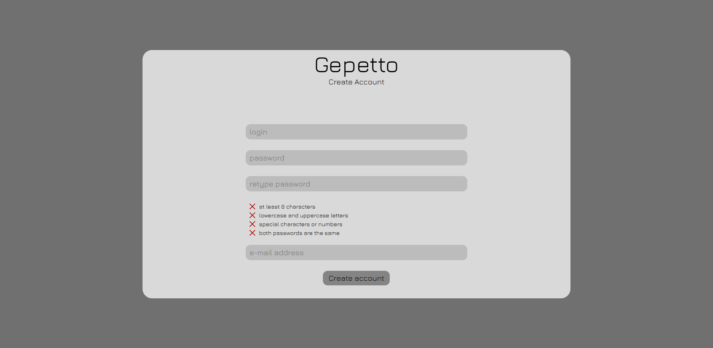
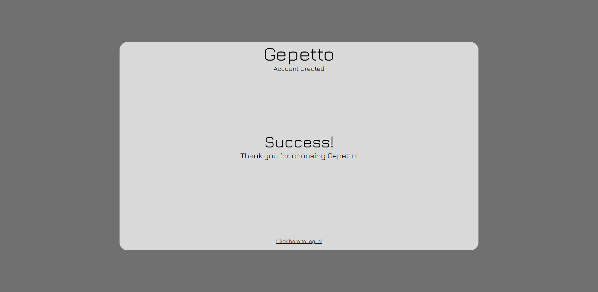
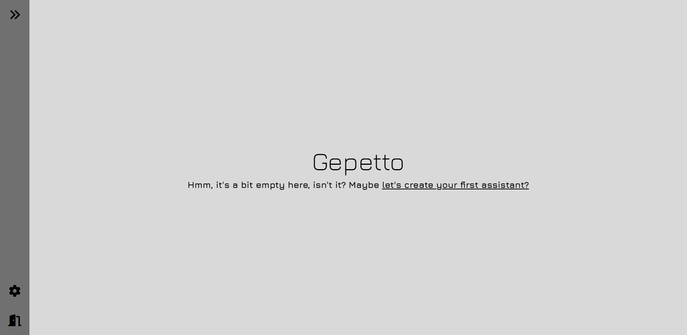
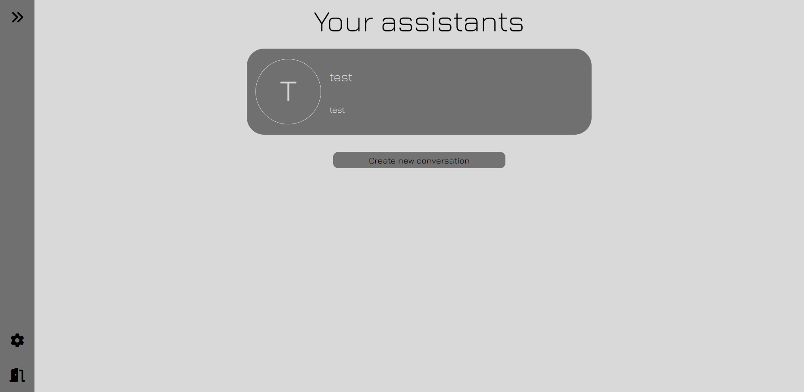
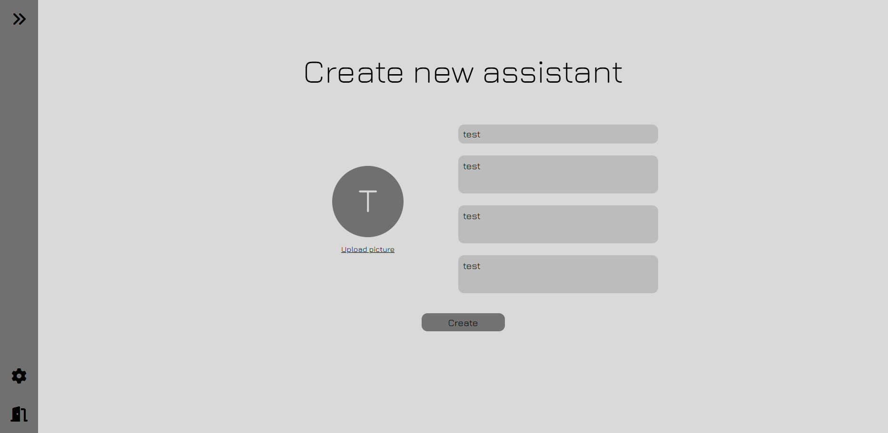
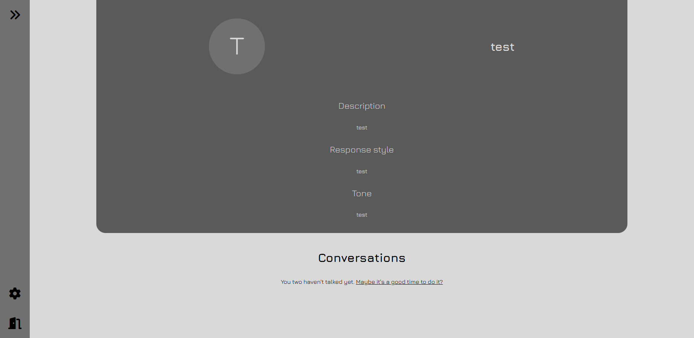
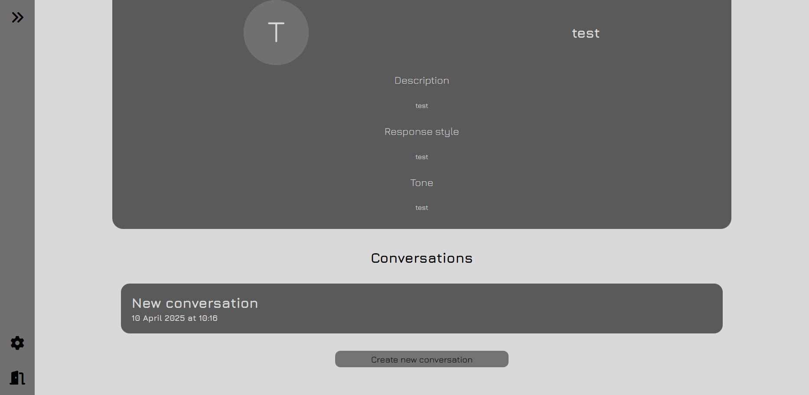
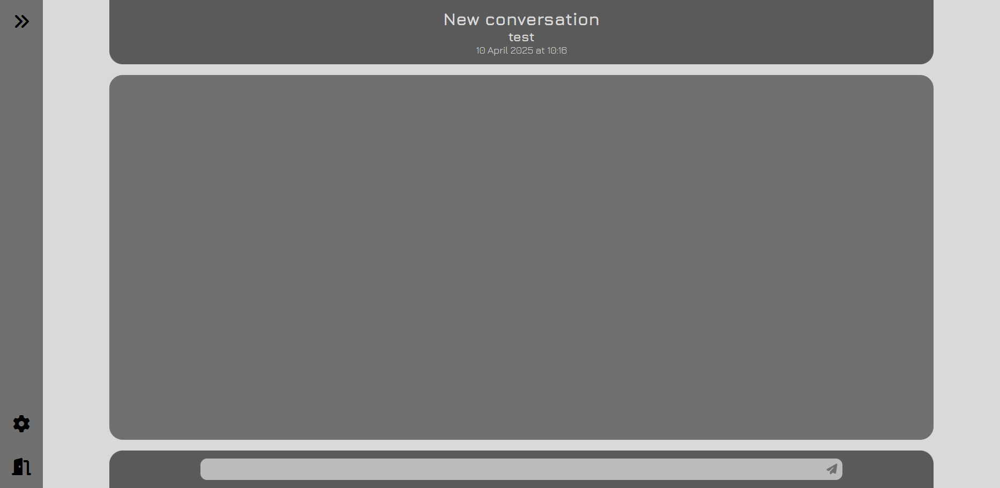

# Gepetto
### How does it work
- Django, split between two apps, frontend and backend, using SQLite3 database.
- Frontend created in basic HTML/CSS/JS using Swup.js for smooth transitions between pages and JSEncrypt for safe data exchange.
- Backend in form of Rest API, uses OpenAI library to generate chat responses and Crypto for encryption and decryption of data, is split between endpoints (for certain endpoints token authorization is required):
  - /api/user
    - Methods: GET, POST
    - GET - checks if user with given username and/or email exists
    - POST - creates new account
  - /api/login
    - Methods: POST
    - POST - checks if user with given username and password exists and responds with newly generated session token
  - /api/assistant
    - Methods: GET, POST
    - GET - responds with all assistants that user has permissions to or responds with assistant that has given assistant_id
    - POST - creates new assistant using given name, description, response style, tone and profile picture
    - Requires token authorisation
  - /api/conversation
    - Methods: GET, POST
    - GET - responds with all conversations assigned to an assistant of given id or responds with a conversation of given id
    - POST - creates new conversation with assistant of given id
    - Requires token authorisation
  - /api/message
    - Methods: POST
    - POST - posts new message in conversation of given id and responds with OpenAI's response
    - Requires token authorisation
  - /api/public_key
    - Methods: GET
    - GET - responds with public key for data encryption
- Backend operates on SQLite3 database split between tables:
  - UserCredentials
    - id - unique user identificator
    - name - username
    - email - email
    - password - password encrypted using make_password - django's built-in function
  - UserTokens
    - id - internal unique token identificator
    - user - foreign key refering to UserCredentials table
    - token - unique session token
    - time_of_creation - time when token was generated, used to check if token is expired
  - Assistant
    - id - unique assistant identificator
    - name - assistant's name
    - description - assistant's description
    - response_style - assistant's response style
    - tone - assistant's tone
    - profile_picture - assistant's profile picture
  - AssistantPermissions
    - user - foreign key refering to UserCredentials table
    - assistant - foreign key refering to Assistant table
    - can_edit - specifies if user has permissions to edit this assistant
    - can_delete - specifies if user has permissions to delete this assistant
    - can_view - specifies if user has permissions to view this assistant
  - Conversation
    - assistant - foreign key refering to Assistant table
    - name - name of the conversation
    - date_of_creation - time when the conversation was created
  - ConversationPermissions
    - user - foreign key refering to UserCredentials table
    - conversation - foreign key refering to Conversation table
    - can_edit - specifies if user has permissions to edit this conversation, fx. send messages
    - can_delete - specifies if user has permissions to delete this conversation
    - can_view - specifies if user has permissions to view this conversation
  - ConversationMessage
    - conversation - foreign key refering to Conversation table
    - message - sent message (in future: array of parts of messages, fx. text, images, referral to other messages)
    - date_of_creation - time when the message was sent
    - sent_by - foreign key refering to UserCredentials table; if id = 0, message was sent by assistant
- Frontend is split between pages
  - /
    - Login page
    
  - /create-acc
    - Create account page
    
  - /create-acc-success
    - Page that shows up when account is created successfully
    
  - /app
    - Page that show all of user's assistants
    
    
  - /create-assistant
    - Create assistant page
    
  - /assistant
    - Page that lists all conversations with certain assistant
    
    
  - /conversation
    - Page where the conversation with assistant is taking place
    
  - There's also a sidebar 
    - Allows to go back to main page, to settings page and to log out
    

### What do you need to install it for yourself
- [Python ~=3.9](https://www.python.org/ftp/python/3.13.3/python-3.13.3-amd64.exe)
- [Git](https://git-scm.com/downloads/win)
- [OpenSSL](https://github.com/openssl/openssl?tab=readme-ov-file#build-and-install)
- [WSL](https://learn.microsoft.com/en-us/windows/wsl/install)

### How to install it for yourself
1. Open WSL (Ubuntu)
2. Clone Gepetto repository 
```git clone https://github.com/kabanos2137/Gepetto.git```
3. Go to the Gepetto directory
```cd ./Gepetto```
4. Install needed libraries
```pip install -r requirements.txt```
5. Generate private key
```openssl genpkey -algorithm RSA -out private.pem -pkeyopt rsa_keygen_bits:2048```
6. Generate public key
```openssl rsa -in private.pem -pubout -out public.pem```
7. Create .confidential.env file and type there
```
OPENAI_API_KEY=<your key here>
OPENAI_API_BASE=<your azure openai endpoint here>
```
8. Run server
```python manage.py runserver```